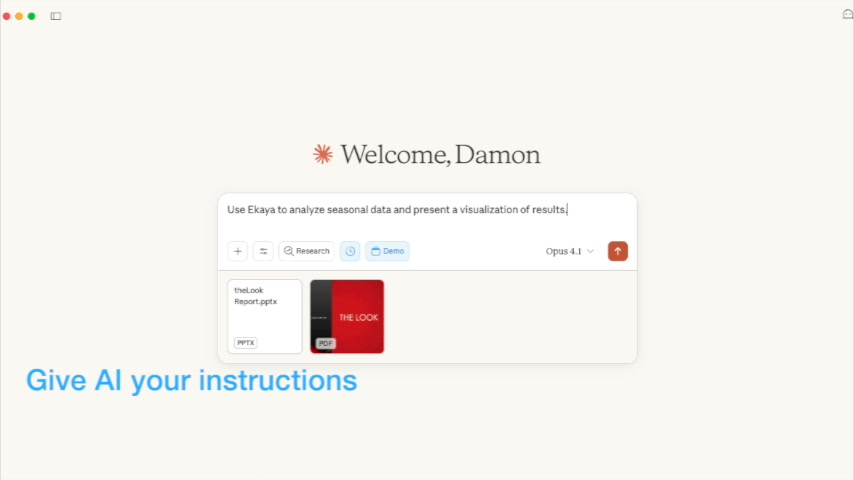

# ekaya-engine

[](https://cdn.ekaya.ai/videos/ekaya-demo-ai-liaison.mp4)

Ekaya Engine connects AI to databases safely and securely. It is an MCP Server that gives you full control over the tools available to the MCP Client, with intelligent ontology creation optimized _for LLMs by LLMs_. Deploy on localhost for personal database access during application development or data engineering, or into your infrastructure for access by business users or AI agents.

Built with Go, React, and PostgreSQL with multi-tenant isolation via Row-Level Security.

## Quickstart (Docker)

The quickstart image bundles PostgreSQL and Ekaya Engine into a single container.

This is perfect to try out Ekaya or if you need to do a one-off ETL task and do not want to install the server.

```bash
docker run --pull always -p 3443:3443 -v ekaya-data:/var/lib/postgresql/data ghcr.io/ekaya-inc/ekaya-engine-quickstart:latest
```

Open your browser to [http://localhost:3443](http://localhost:3443) to sign in and provision a project.

## Deployment

Since Ekaya Engine connects to your database as a datasource for AI analytics, it needs to run in an environment:

1. That has network access to your datasource,
1. Where business users can access it; and
1. That the server has a Fully Qualified Domain Name (FQDN) with TLS certificates matching that domain.

Ekaya requires a PostgreSQL 14+ instance for its own data. The installer will ask for your PostgreSQL connection details and generate a configuration file.

### macOS and Linux

```bash
curl --proto '=https' --tlsv1.2 -LsSf https://github.com/ekaya-inc/ekaya-engine/releases/latest/download/install.sh | sh
```

The script detects your OS and architecture, downloads the correct binary, verifies its checksum, and walks you through an interactive configuration. It installs to `/usr/local/bin` and writes a config file to `~/.ekaya/config.yaml`.

To customize the install and config locations:

```bash
curl --proto '=https' --tlsv1.2 -LsSf https://github.com/ekaya-inc/ekaya-engine/releases/latest/download/install.sh | INSTALL_DIR=~/.local/bin CONFIG_DIR=~/.ekaya sh
```

### Windows

Download the latest `.zip` from [GitHub Releases](https://github.com/ekaya-inc/ekaya-engine/releases), extract it, and add the directory to your PATH. Then create a `config.yaml` file from the included `config.yaml.example`.

### Manual download

Pre-built binaries for all platforms are available on the [Releases page](https://github.com/ekaya-inc/ekaya-engine/releases). Each release includes binaries for macOS (Intel and Apple Silicon), Linux (x86_64 and ARM64), and Windows (x86_64).

### After installing

The Ekaya Engine will look in the CWD (first) then fallback to `~/.ekaya/` for the `config.yaml` file.

If needed per installation above:

```bash
cp config.yaml.example config.yaml
```

Update/review the config.yaml.

Two secrets are required in `config.yaml` (or as environment variables):

| Secret | Env Var | Purpose |
|--------|---------|---------|
| `project_credentials_key` | `PROJECT_CREDENTIALS_KEY` | Encrypts datasource credentials. **Cannot be changed after storing credentials.** |
| `oauth_session_secret` | `OAUTH_SESSION_SECRET` | Signs OAuth session cookies. All servers in a cluster must share the same value. |

You can create secure secrets using:

```bash
openssl rand -base64 32
```

### Running the Server

Start the server:

```bash
ekaya-engine
```

Open [http://localhost:3443](http://localhost:3443) to sign in and provision a project. Migrations run automatically on first startup.

## Docker image

If you want to deploy via Docker, see [deploy/docker/](deploy/docker/) for the full guide.

## Build from source

Integration tests (`make check`) require Docker. If your Docker runtime uses a non-default socket path (e.g., OrbStack), set `DOCKER_HOST`:

```bash
export DOCKER_HOST=unix://$HOME/.orbstack/run/docker.sock
```

Build the Go binary with embedded UI and deploy anywhere. See [deploy/source/](deploy/source/) for the full guide.
